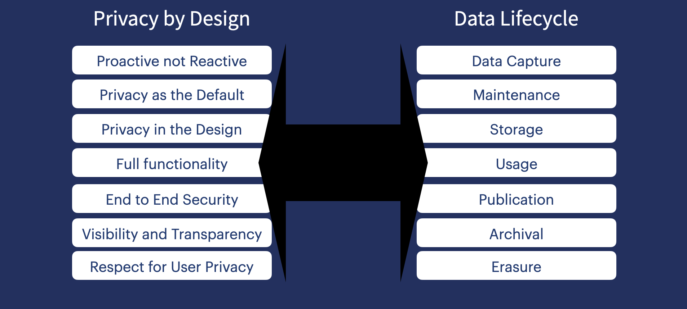

# Privacy Toolbox

[![CC BY-SA 4.0][cc-by-sa-shield]][cc-by-sa]

This work is licensed under a [Creative Commons Attribution-ShareAlike 4.0 International License][cc-by-sa].

[cc-by-sa]: https://creativecommons.org/licenses/by-sa/4.0/
[cc-by-sa-image]: https://licensebuttons.net/l/by-sa/4.0/88x31.png
[cc-by-sa-shield]: https://img.shields.io/badge/License-CC%20BY--SA%204.0-lightgrey.svg

Start quickly here - ["Master Checklist"](./checklists/docs/master-checklist.json.md)

## Developers Care About Privacy More Than Their Employers

New research finds that more than 70% of developers believe privacy is an afterthought at their company so let's take control and solve the problem. Full research [here](https://dataprotocol.com/data-privacy-report)

## Introduction

This is a community driven project to collect, design, the most helpful developer data privacy tools such as checklists, cheatsheets and examples, to help avoid making mistakes and being wrong.

We are currently collecting the following types of help

|    Type     |                Directory                | Notes                                                                                                 |
| :---------: | :-------------------------------------: | :---------------------------------------------------------------------------------------------------- |
| Checklists  |  [/checklists](./checklists/README.md)  | A collated list of checklists to help with the most common developer tasks from a privacy perspective |
| Cheatsheets | [/cheatsheets](./cheatsheets/README.md) | Shortcuts, tools, best practices                                                                      |
|  Mistakes   |    [/mistakes](./mistakes/README.md)    | A collated list of privacy mistakes to avoid and how                                                  |
|     New     |                   XXX                   | Issue a pull list to create a new category of help                                                    |

## Community Contributions

We need your contributions to improve these tools.

The project welcomes all offers of help including improving the provided check lists, creating additional checklists, improved presentation tooling, and your thoughts and recommendations for wider ecosystem integration & adoption.

Follow the instructions in the [checklists-data directory](/checklists-data/README.md) on submitting a checklist for inclusion.

## Further Reading

If you are passionate about privacy and data management, here are some additional resources you might enjoy.

- "DEVELOPERS CARE ABOUT PRIVACY MORE THAN THEIR EMPLOYERS" - New research from HarrisX and Data Protocol finds that more than 70% of developers believe privacy is an afterthought at their company. “[TEACH, TRAIN, & TRUST - A Study of Data Practices Among Developers](https://dataprotocol.com/data-privacy-report)”
- Read "[Privacy by Design](https://www.manning.com/books/privacy-engineering)", the latest book by Data Protocol Advisory board member [Nishant Bhajaria](https://dataprotocol.com/advisory-board/nishant-bhajaria). Learn how Nishant has implemented privacy engineering for real at companies such as Nike, Netflex, Google and Uber.
- Review the growing range of Privacy training for Developers provided by [Data Protocol](https://dataprotocol.com).
