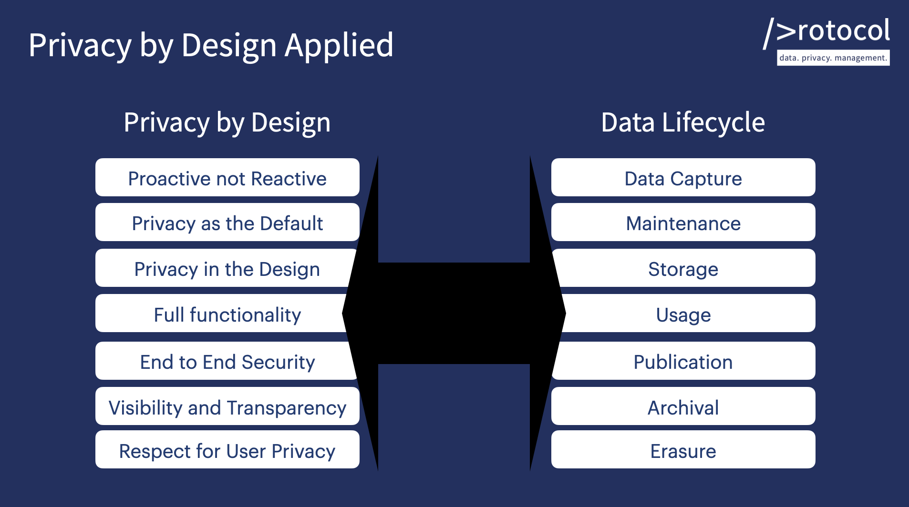

# Privacy Checklists

Community driven best practice developer checklists to avoid making mistakes and being wrong.

It is impossible to learn all of the ever increasing data laws in the world as technology becomes more and more regulated. Even if we could, we would not have enough time. But at the same time none of us want to make simple mistakes and be wrong. And we live in a high pressure world where we are asked to ship code faster and faster while the repurcussions of making mistakes are exponentially increasing.

The Privacy Checklists project is part of [Data Protocol](https://dataprotocol.com) which enables developers build data products with confidence and without lawyers. Data Protocol is about empowering developers to lead and control their own domain, even when time is pressured.

Privacy Checklists combines the concept of **Jobs To be Done** with the concept of **checklists**. When complicated domains are expected to execute at scale with the need for high quality results and minimum mistakes, it has been proven that checklists can dramatically change outcomes for the better. It also helps all involved to be feel better, to feel more in control, and to feel empowered in the moment.

The project is licensed under the "[Creative Commons](./LICENSE") license and the checklist content is free to use for all. The checklists are submitted by experts in a JSON format to allow the content to be pulled and displayed with complete freedom. The Privacy Checklist project has built a presentation layer to convert the json files into best practice human readable checklists.

The goal of the project, combined with all other [Data Protocol](https://dataprotocol.com) initiatives, is to empower developers to have control in their own domain - writing software and building great products.

## 1: Jobs To Be Done

Existing privacy advice and help is orientated around the concepts found in regulations, using the language and process of lawyers. Developers need help that aligns around developer work processes, using language developers understand, and around tasks developers already do but need to understand better from a data privacy point of view. **Checklists need to be designed around developer "Jobs To Be Done", NOT lawyers**

## 2: Checklists

The implementation of simple checklists in complex domains has seen dramatic improvements in results and outcomes.

> When checklists have been implemented for use by surgical teams, deaths dropped 40 percent.
> You never fly in a plane when the pilot has not used a checklist

Should you surf online when the same discipline is not in place? Recent privacy breaches suggest no and public sentiment is increasingly vocal in that direction.

Mission critical, complex jobs and processes have implemented checklists and the outcomes have dramatically improved.

To quote "[The Checklist Manifesto: How to Get Things Right](https://www.amazon.com/Checklist-Manifesto-How-Things-Right-ebook/dp/B0030V0PEW/ref=sr_1_1?crid=118YTNHN89QT7&dchild=1&keywords=the+checklist+manifesto&qid=1623581469&sprefix=the+checklist+m%2Caps%2C210&sr=8-1)" by Atul Gawande.

> “The volume and complexity of what we know has exceeded our individual ability to deliver its benefits correctly, safely, or reliably. Knowledge has both saved us and burdened us.”
> “Checklists seem to provide protection against failures. They remind us of the minimum necessary steps and make them explicit. They not only offer the possibility of verification but also instill a kind of discipline of higher performance.”

The researchers found that simply having doctors and nurses in an ICU create their own checklists for what they thought should be done each day improved the consistency of care to the point that the average length of patient stay in intensive care dropped by half.

## Community Driven Developer Checklists for Jobs To Be Done

Contributing a checklist is easy. A good checklist is not complicated, it should fit on one page, with between 5-9 items, which aligns with the natural limit of working memory in humans. The language should be familiar to the profession e.g. developer speak, developer jobs to be done, developer native.

Follow the instructions in the [checklists-data](./checklists-data/README.md) directory on submitting a checklist for inclusion.
